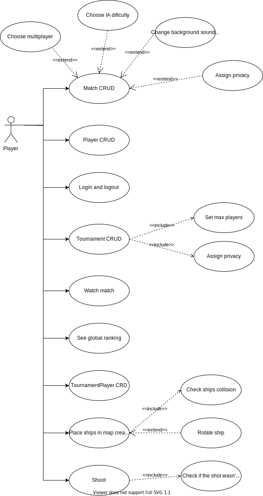

<h2 align="center"><strong align="center">Front end</strong></h2>

## [Check our Back end](https://github.com/Henrique-Temponi/naval-battle-game-backend)

## Members

- [alicecabral](https://github.com/alicecabral)
- [axell-brendow](https://github.com/axell-brendow)
- [HRKings](https://github.com/HRKings)
- [Henrique-Temponi](https://github.com/Henrique-Temponi)

## Technologies

## Use cases diagram

